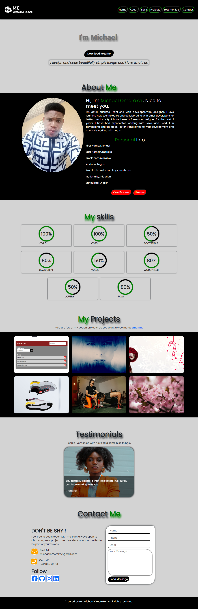

# Portfolio
  Hi, i'm Michael Omoraka, a web designer/front-end developer, nice to meet you. And this is my portfolio.

> Live demo, click [_here_](https://michaelomoraka.netlify.app/). 

## Table of Contents
* [Technologies Used](#technologies-used)
* [Screenshots](#screenshots)
* [Setup](#setup)
* [Project Status](#project-status)

## Technologies Used
- HTML5
- CSS3 
- BOOTSTRAP
- JAVASCRIPT 

## Screenshots

## Setup
To build this project, the following are required:
- Text editor: This is needed to write your code. You can use any text editor of your choice. In this case, i used VSCode. click [_here_](https://code.visualstudio.com/Download) to download 

- Browser: You can use any brower of your choice, e.g: Chrome, Firefox etc. it is always advisable to test your site across multiple browers to check compatibility.

## Project Status
Project is: _complete_

